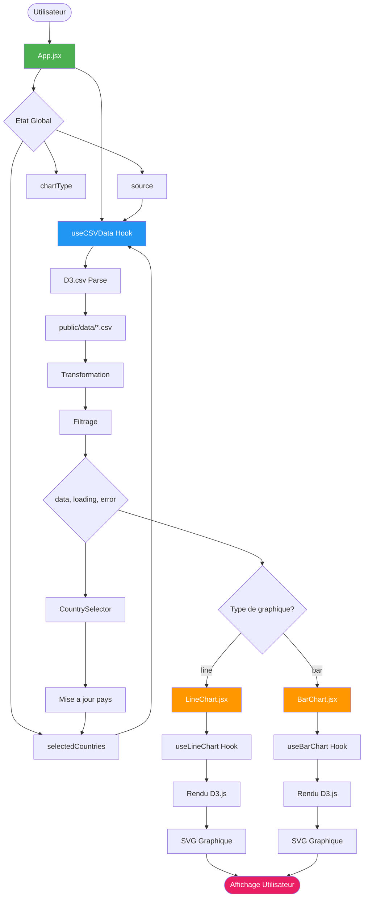
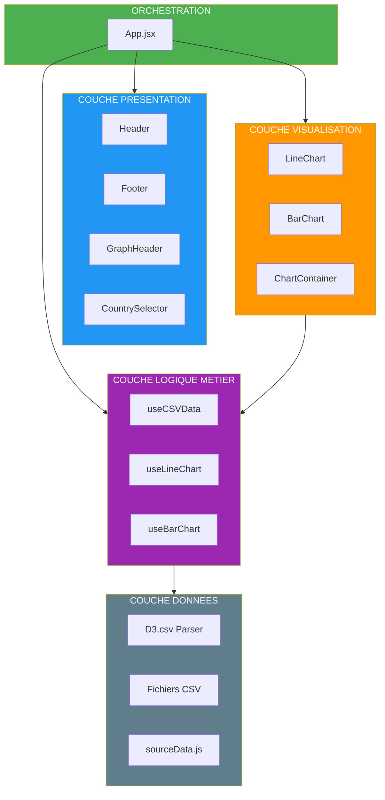
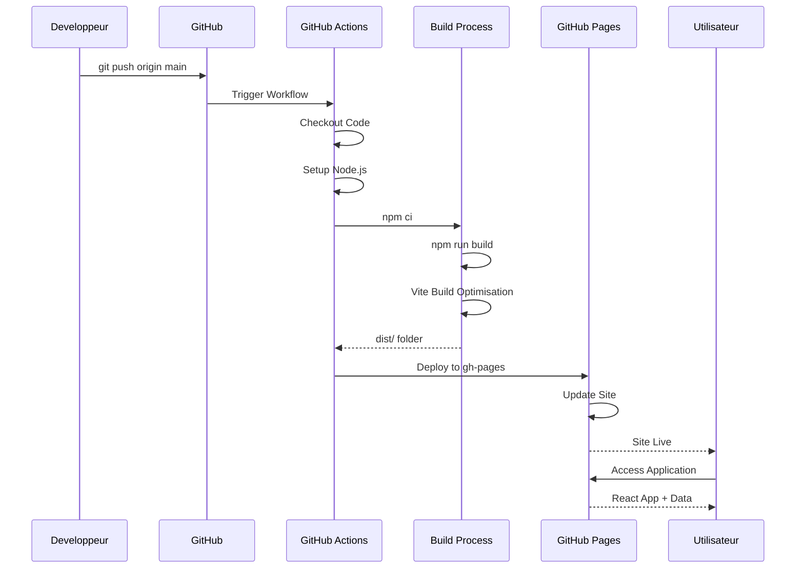

```mermaid
graph TB
    Root["energy-data-explorer/"]
    
    Root --> Public["public/"]
    Root --> Src["src/"]
    Root --> Github[".github/"]
    Root --> Config["Config Files"]
    
    Public --> Data["data/"]
    Data --> CSV1["renouvelable.csv"]
    Data --> CSV2["solaire.csv"]
    Data --> CSV3["... 8 autres sources"]
    
    Src --> Components["components/"]
    Src --> Hooks["hooks/"]
    Src --> Constants["constants/"]
    Src --> AppJsx["App.jsx"]
    Src --> MainJsx["main.jsx"]
    
    Components --> Charts["charts/"]
    Components --> Layout["layout/"]
    Components --> UI["ui/"]
    Components --> CountrySelector["CountrySelector.jsx"]
    
    Charts --> LineChart["LineChart/"]
    Charts --> BarChart["BarChart/"]
    LineChart --> LC1["LineChart.jsx"]
    LineChart --> LC2["useLineChart.js"]
    BarChart --> BC1["BarChart.jsx"]
    BarChart --> BC2["useBarChart.js"]
    
    Layout --> Header["Header.jsx"]
    Layout --> Footer["Footer.jsx"]
    Layout --> GraphHeader["GraphHeader.jsx"]
    Layout --> SourceDesc["SourceDescription.jsx"]
    
    UI --> ChartContainer["ChartContainer.jsx"]
    UI --> ChartControls["ChartControls.jsx"]
    UI --> LoadingSpinner["LoadingSpinner.jsx"]
    UI --> StatsCard["StatsCard.jsx"]
    
    Hooks --> UseCSV["useCSVData.js"]
    Hooks --> UseChart["useChartData.js"]
    
    Constants --> SourceData["sourceData.js"]
    
    Github --> Workflows["workflows/"]
    Workflows --> Deploy["deploy.yml"]
    
    Config --> Package["package.json"]
    Config --> Vite["vite.config.js"]
    Config --> Tailwind["tailwind.config.js"]
    Config --> ESLint["eslint.config.js"]
    
    style Root fill:#4CAF50,color:#fff
    style Src fill:#2196F3,color:#fff
    style Components fill:#FF9800,color:#fff
    style Charts fill:#E91E63,color:#fff
    style Hooks fill:#9C27B0,color:#fff
```

# 📊 DIAGRAMMES D'ARCHITECTURE

---

## 1️⃣ STRUCTURE DU PROJET (Mermaid)



---

## 2️⃣ FLUX DE DONNÉES (Mermaid)



---

## 3️⃣ ARCHITECTURE EN COUCHES (Mermaid)



---

## 4️⃣ CYCLE DE VIE CI/CD (Mermaid)



---

## 🎨 INSTRUCTIONS POUR CRÉER VOS DIAGRAMMES

### Option 1: Mermaid (Déjà inclus ci-dessus)
Les diagrammes Mermaid s'affichent automatiquement sur GitHub. Copiez le code dans votre rapport.

### Option 2: Excalidraw (Recommandé pour rapport PDF)

**Étapes :**
1. Allez sur https://excalidraw.com
2. Créez votre diagramme avec ces éléments :

**Structure du Projet :**
```
┌─────────────────────────────────────┐
│   energy-data-explorer/             │
├─────────────────────────────────────┤
│                                     │
│  📁 public/data/                    │
│     └─ 10 fichiers CSV              │
│                                     │
│  📁 src/                            │
│     ├─ 📊 components/charts/        │
│     │   ├─ LineChart/               │
│     │   └─ BarChart/                │
│     ├─ 🎨 components/layout/        │
│     ├─ 🧩 components/ui/            │
│     ├─ 🎣 hooks/                    │
│     ├─ ⚙️ constants/                │
│     └─ 🎯 App.jsx                   │
│                                     │
│  📁 .github/workflows/              │
│     └─ deploy.yml                   │
│                                     │
│  ⚙️ Config Files                    │
│     ├─ package.json                 │
│     ├─ vite.config.js               │
│     └─ tailwind.config.js           │
└─────────────────────────────────────┘
```

3. Utilisez ces couleurs :
   - **Vert (#4CAF50)** - Racine/Principal
   - **Bleu (#2196F3)** - Composants
   - **Orange (#FF9800)** - Charts
   - **Violet (#9C27B0)** - Hooks
   - **Gris (#607D8B)** - Config

4. Exportez en PNG (haute résolution)

---

### Option 3: Draw.io

**Étapes :**
1. Allez sur https://app.diagrams.net
2. Choisissez "Create New Diagram"
3. Sélectionnez template "Flowchart" ou "UML"
4. Utilisez les formes :
   - **Rectangles** pour dossiers
   - **Rectangles arrondis** pour fichiers
   - **Flèches** pour flux de données
   - **Couleurs** comme ci-dessus

5. Exportez en PNG ou SVG

---

## 📐 TEMPLATE POUR VOTRE RAPPORT

Ajoutez cette section dans votre rapport :

```markdown
### Structure du Projet (Diagramme)


**Légende :**
- 🟢 Vert - Orchestration principale (App.jsx)
- 🔵 Bleu - Composants de présentation
- 🟠 Orange - Visualisations D3.js
- 🟣 Violet - Logique métier (Hooks)
- ⚫ Gris - Configuration et données
```

---

## 💡 CONSEIL PROFESSIONNEL

Pour un rapport UM6P, je recommande :

1. **Mermaid** dans le document Markdown (GitHub)
2. **Excalidraw** pour export PNG haute qualité (PDF)
3. **3 diagrammes essentiels :**
   - Structure du projet
   - Flux de données
   - Architecture en couches

---

Voulez-vous que je vous aide à créer un diagramme spécifique ou à l'exporter dans un format particulier ?
