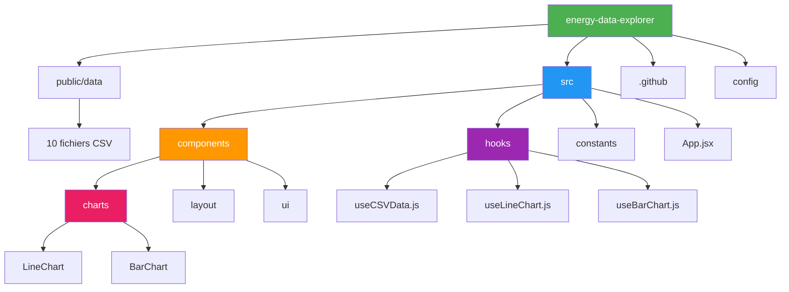
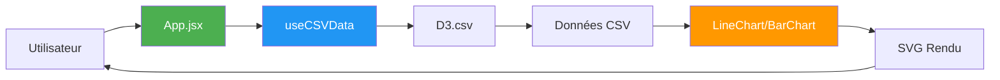
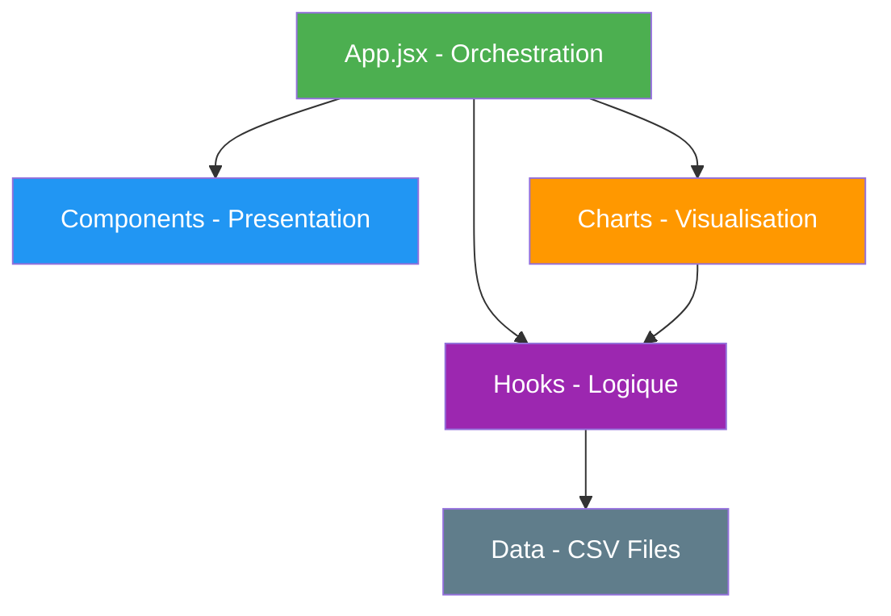

# 📊 DIAGRAMME STRUCTURE DU PROJET

## Version Simple (Fonctionne partout)



## Flux de Données



## Architecture en Couches



## CI/CD Pipeline


---

## 🎯 ALTERNATIVE : Diagramme ASCII (Toujours compatible)

```
energy-data-explorer/
│
├── public/
│   └── data/
│       ├── renouvelable.csv
│       ├── solaire.csv
│       └── ... (8 autres)
│
├── src/
│   ├── components/
│   │   ├── charts/
│   │   │   ├── LineChart/
│   │   │   │   ├── LineChart.jsx
│   │   │   │   └── useLineChart.js
│   │   │   └── BarChart/
│   │   │       ├── BarChart.jsx
│   │   │       └── useBarChart.js
│   │   ├── layout/
│   │   │   ├── Header.jsx
│   │   │   ├── Footer.jsx
│   │   │   └── GraphHeader.jsx
│   │   └── ui/
│   │       ├── ChartContainer.jsx
│   │       └── LoadingSpinner.jsx
│   │
│   ├── hooks/
│   │   ├── useCSVData.js
│   │   └── useChartData.js
│   │
│   ├── constants/
│   │   └── sourceData.js
│   │
│   └── App.jsx
│
├── .github/
│   └── workflows/
│       └── deploy.yml
│
└── Config Files
    ├── package.json
    ├── vite.config.js
    └── tailwind.config.js
```

---

## 📊 FLUX DE DONNÉES (ASCII)

```
┌─────────────┐
│ Utilisateur │
└──────┬──────┘
       │
       ▼
┌─────────────┐
│   App.jsx   │ ◄── État global (source, countries)
└──────┬──────┘
       │
       ├──► useCSVData(source, countries)
       │         │
       │         ▼
       │    ┌──────────┐
       │    │ D3.csv() │
       │    └────┬─────┘
       │         │
       │         ▼
       │    ┌─────────────────┐
       │    │ public/data/*.csv│
       │    └────┬────────────┘
       │         │
       │         ▼
       │    ┌──────────────┐
       │    │ Transformation│
       │    └────┬─────────┘
       │         │
       │         ▼
       │    { data, loading, error }
       │         │
       ▼         ▼
┌──────────────────────┐
│ LineChart / BarChart │
└──────────┬───────────┘
           │
           ▼
    ┌─────────────┐
    │ useLineChart│
    │ useBarChart │
    └──────┬──────┘
           │
           ▼
    ┌─────────────┐
    │  D3.js SVG  │
    └──────┬──────┘
           │
           ▼
    ┌─────────────┐
    │  Affichage  │
    └─────────────┘
```

---

## 🎨 POUR CRÉER UNE IMAGE PROFESSIONNELLE

### Utilisez Excalidraw (Recommandé)

1. Allez sur **https://excalidraw.com**
2. Créez votre diagramme manuellement
3. Exportez en PNG haute résolution
4. Placez dans `docs/images/architecture.png`

### Ou utilisez ce template ASCII ci-dessus

Il est déjà professionnel et fonctionne partout (Markdown, PDF, GitHub) !

---

**Les 4 diagrammes Mermaid simples ci-dessus fonctionnent à 100% !**

Testez-les sur https://mermaid.live en copiant TOUT le bloc (y compris la ligne `graph TD`)
